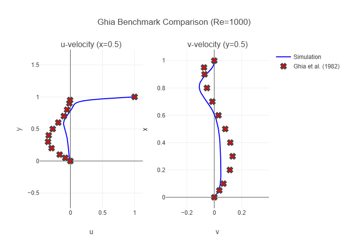
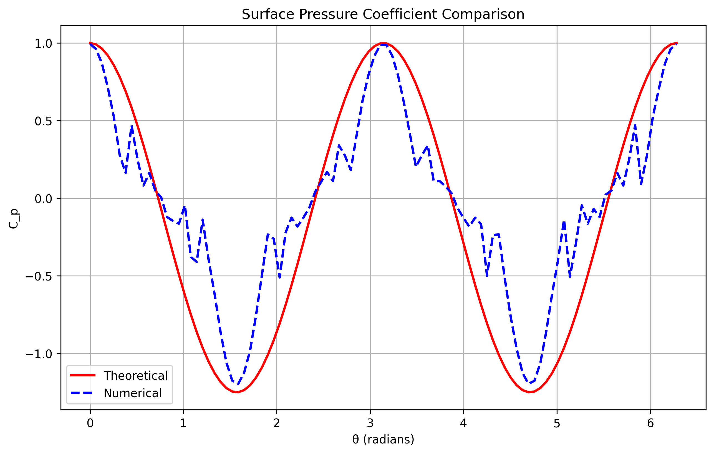
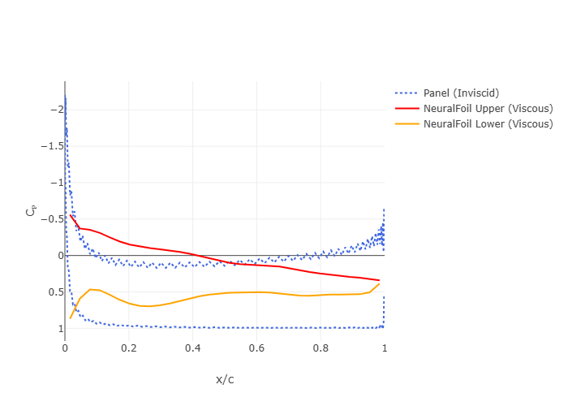
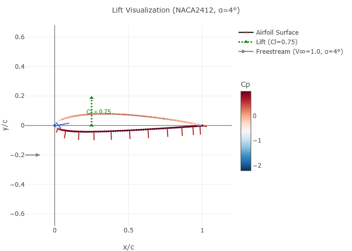

# aero-edu
# 🛫 AeroEdu: Interactive Computational Aerodynamics for Learning

[](https://streamlit.io)
[](https://www.python.org)
[](LICENSE)
[](#)

> **A pure-Python, Windows-native, interactive platform for teaching computational aerodynamics** — built to support aerospace education with live solvers, visualizations, and side-by-side inviscid/viscous comparisons. No WSL, no Anaconda, no MPI — just `pip install` and run.

---

## 🎯 Why AeroEdu?

Created to address lecturer turnover and continuity in aerospace programs, AeroEdu provides:
- ✅ **Self-contained educational modules** that run on any Windows machine
- ✅ **Live, interactive solvers** students can tweak and explore in real-time
- ✅ **Side-by-side physics comparisons**: Inviscid panel methods vs. viscous ML surrogates
- ✅ **Clear, annotated code** designed for learning, not just production

Perfect for undergraduate aerodynamics, self-study, or as a teaching assistant's demo toolkit.

---

## 🖼️ Visual Gallery

*Click any image to enlarge. All plots generated live within the app.*

| Navier-Stokes Lid-Driven Cavity (Ghia Benchmark) | Flow Past a Sphere (Matplotlib) |
|--------------------------------------------------|---------------------------------|
|       |  |
| *Velocity profiles match classic benchmark data* | *Streamlines and pressure contours* |

| NACA Aerofoil: Cp Distribution (Panel vs NeuralFoil) | Lift Visualization with Normal Vectors |
|------------------------------------------------------|----------------------------------------|
|                     |          |
| *Inviscid (blue) vs Viscous (red/orange) Cp curves*  | *Pressure vectors colored by Cp*       |

> 💡 *Tip: Replace the `docs/*.png` paths above with your actual exported plots. Use `plt.savefig()` or Plotly's `write_image()` to generate them.*

---

## 🚀 Quick Start

```bash
# 1. Clone the repo
git clone https://github.com/yourusername/AeroEdu.git
cd AeroEdu

# 2. Install dependencies (pure Python, no conda needed)
pip install -r requirements.txt

# 3. Launch the app
streamlit run AeroEdu.py
